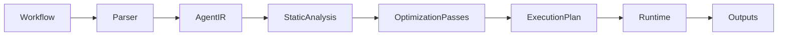

# AgentIR

> **A Compiler-Inspired Intermediate Representation and Optimization Framework for AI Agent Workflows**

AgentIR is an open-source compiler-inspired infrastructure for AI agent workflows. Instead of executing workflows directly, AgentIR compiles them into a common Intermediate Representation (IR), performs static analysis and validation, applies graph optimization passes, generates an optimized execution plan, and executes the resulting workflow asynchronously.

---

## About

AgentIR brings traditional compiler design principles to AI agent orchestration. Modern frameworks (like LangGraph, CrewAI, and LlamaIndex) excel at defining and running agent workflows, but they execute graphs exactly as written.

AgentIR bridges this gap by introducing a compilation layer that decouples **workflow definition** from **workflow execution**:
* **Common Intermediate Representation (IR)**: Workflow graphs are parsed into a unified, framework-agnostic IR, standardizing node properties and port-based control transitions.
* **Static Graph Analysis**: Sanity checks (reachability, dangling edges, infinite loops) and data-flow input/output constraints are analyzed statically.
* **Graph Optimizations**: Standard compiler transformations (Dead Node Elimination, Common Subexpression Elimination for duplicate tools, and data-flow parallelization) are applied to rewrite the graph into a cheaper, faster pipeline.
* **Execution Stage Scheduling**: Estimates serial vs. parallel latencies using critical-path analysis, compiling concurrent execution schedules.

---

## High-Level Pipeline



---

## Directory Structure

```text
agentir/
├── ir/             # Core Intermediate Representation (Node, Edge, Graph)
├── parser/         # LangGraph and dictionary workflow importers
├── analyzer/       # Static analysis (Dependency tracking, topological scheduling, loop-aware validation)
├── optimizer/      # Compiler optimization passes (Dead node, duplicate tool, parallel scheduling, caching)
├── runtime/        # Asynchronous execution stage planning and dynamic execution engine
├── visualizer/     # Diagram generation (Graphviz DOT files and CSS-themed Mermaid charts)
├── docs/           # Documentation specifications (ARCHITECTURE.md)
├── examples/       # Benchmarking examples (benchmark.py and benchmark.ipynb)
└── tests/          # pytest unit test suites
```

---

## Key Features

1. **Polymorphic IR**: Discriminated Pydantic v2 schemas representing structural, LLM, tool, and conditional routing nodes.
2. **Static Analysis & Data Flow Checking**: Kahn's topological scheduling levels, reachable/dead-end verification, data-flow variable input validation, and loop check cycle safety.
3. **Graph Optimizations**:
   - *Dead Node Elimination (DCE)*: Recursively cleans unused, unreachable, or unread nodes, bypassing control flow.
   - *Duplicate Tool Merging (CSE)*: Combines redundant external calls with identical parameters.
   - *Control Edge Parallelization*: reschedule pipelines into concurrent branches when data-independent.
   - *Cache Insertion*: Annotates expensive steps with deterministic hash keys.
4. **Dynamic Runtime Engine**: Asynchronous, trigger-driven executor with branch join barriers and exponential backoff retry policies.
5. **Inline Visualization**: Automatic rendering of Graphviz and styled Mermaid flowchart blocks.

---

## Benchmarks & Performance Savings

A performance evaluation is available in [benchmark.py](file:///Users/asmohamedarfeen/Desktop/project/foss%20agentir/agentir/examples/benchmark.py) and [benchmark.ipynb](file:///Users/asmohamedarfeen/Desktop/project/foss%20agentir/agentir/examples/benchmark.ipynb). 

Optimizing a standard agent pipeline with AgentIR yields **33.3% execution latency savings** and a **66.7% reduction in tool calls**:

| Metric | Unoptimized | Optimized | Savings |
|---|---|---|---|
| Wall-clock Execution Time | 2.404s | 1.604s | 33.3% |
| External Tool Invocations | 3 | 1 | 66.7% |
| LLM Inference Calls | 1 | 1 | 0.0% |

---

## Setup & Installation

Ensure you have Python 3.12+ and `uv` installed. Clone the repository and install the dependencies:

```bash
# Clone the repository
git clone https://github.com/asmohamedarfeen/AgentIR.git
cd AgentIR

# Install dependencies using uv
uv sync
```

---

## Quick Start & Running Benchmarks

### 1. Run the Python Benchmark Script
Execute the benchmarking program to compare unoptimized sequential runs with optimized AgentIR runs:

```bash
# Running in simulated mode (no API key needed)
PYTHONPATH=. uv run python agentir/examples/benchmark.py

# Running with live Gemini API calls
export GEMINI_API_KEY="your-api-key-here"
PYTHONPATH=. uv run python agentir/examples/benchmark.py
```

### 2. Run the Jupyter Notebooks
Open the interactive notebooks to execute the benchmarks, view graphical Matplotlib comparative reports, and see compiled Graphviz DAG diagrams inline:

```bash
# General AgentIR Benchmark
uv run jupyter notebook agentir/examples/benchmark.ipynb

# LangGraph Integrated Benchmark
uv run jupyter notebook agentir/examples/langgraph_benchmark.ipynb

# LangGraph Multi-Agent Token-Aware Benchmark
uv run jupyter notebook agentir/examples/multi_agent_benchmark.ipynb
```

### 3. Run the Unit Test Suite
To run all 26 test cases checking IR validation, compiler passes, parsing, and execution runtimes:

```bash
uv run pytest
```

---

## Documentation

* **Architecture and Specifications**: Read the detailed compiler design details in [docs/ARCHITECTURE.md](file:///Users/asmohamedarfeen/Desktop/project/foss%20agentir/agentir/docs/ARCHITECTURE.md).
* **Interactive Benchmarks**: 
  - [examples/benchmark.ipynb](file:///Users/asmohamedarfeen/Desktop/project/foss%20agentir/agentir/examples/benchmark.ipynb): General benchmark run.
  - [examples/langgraph_benchmark.ipynb](file:///Users/asmohamedarfeen/Desktop/project/foss%20agentir/agentir/examples/langgraph_benchmark.ipynb): Full native LangGraph integration benchmark with comparative graphs.
  - [examples/multi_agent_benchmark.ipynb](file:///Users/asmohamedarfeen/Desktop/project/foss%20agentir/agentir/examples/multi_agent_benchmark.ipynb): Multi-agent, token-aware optimization benchmark with detailed resource savings charts.

---

## License

This project is licensed under the MIT License - see the [LICENSE](file:///Users/asmohamedarfeen/Desktop/project/foss%20agentir/LICENSE) file for details.
