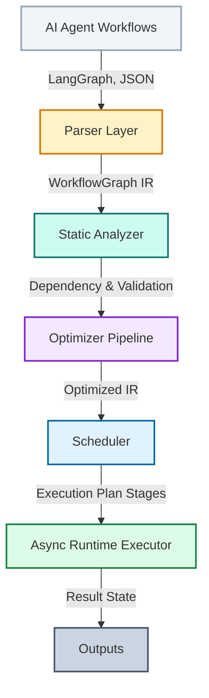

# AgentIR Compiler Architecture & Specifications

AgentIR is an open-source, compiler-inspired intermediate representation and optimization framework designed for AI Agent workflows. Rather than executing graph workflows directly as defined, AgentIR parses workflows into a common Intermediate Representation (IR), performs static analysis and data-flow checking, applies graph optimization passes, generates concurrent execution plans, and runs them asynchronously.

---

## High-Level Architecture Overview

---

## 1. Core Intermediate Representation (IR)

The Intermediate Representation is defined under `agentir.ir` using Pydantic validation models and is completely independent of the execution runtime.

### 1.1 Node Schemas (`node.py`)
AgentIR supports polymorphic node definitions parsed through a discriminated union (`AnyNode`) keyed by the `type` field using `Literal` typing:
* **`StartNode` / `EndNode`**: Represent boundary entries and exits.
* **`LLMNode`**: Configured with `model`, `prompt_template`, `temperature`, and `system_instruction` attributes.
* **`ToolNode`**: Configured with `tool_name` and static `args` dict arguments.
* **`ConditionNode`**: A control-flow branch node configured with a `condition_expr` string and a `branches` routing dictionary (outcome key -> target node ID).
* **`ParallelNode` / `MergeNode`**: Primitives used to handle concurrent fork/join control structures.

### 1.2 Directed Connections (`edge.py`)
Edges connect a `source` node to a `target` node:
* Supports `source_port` and `target_port` mappings (e.g. mapping conditional outcomes like `yes`/`no` to target inputs).
* Supports `condition` rule strings.
* Overrides comparison (`__eq__`) and hashing (`__hash__`) to facilitate seamless NetworkX and set-operation interactions.

### 1.3 Graph Container (`graph.py`)
* **`WorkflowGraph`**: Encapsulates `nodes` (dict of node ID to `AnyNode`) and `edges` (list of `Edge`).
* Includes CRUD helper APIs: `add_node()`, `remove_node()`, `add_edge()`, `remove_edge()`, `get_successors()`, `get_predecessors()`.
* **NetworkX Integration**: Provides bidirectional conversion (`to_networkx()`, `from_networkx()`) to map node object latencies and edge properties onto NetworkX graph instances.

---

## 2. Static Analyzer

Analyzers read and query the `WorkflowGraph` without mutating it.

### 2.1 Dependency Tracing (`dependency.py`)
* **`DependencyAnalyzer`**:
  * Traces transitive control ancestors (`get_dependencies()`) and descendants (`get_dependents()`).
  - Evaluates control independence (`is_independent()`) between two nodes.
  - **`get_execution_layers()`**: Performs topological leveling (Kahn's algorithm) to compute concurrent execution stages. Loop cycles are broken dynamically at `ConditionNode` boundaries (representing loop checks) to prevent deadlocks and establish static sequence barriers.

### 2.2 Graph Validation (`validator.py`)
* **`WorkflowValidator`**: Returns a list of `ValidationIssue` models containing code and severity parameters:
  - **Dangling Edges**: Verifies that every edge points to valid, existing node definitions.
  - **Reachability**: Identifies nodes that are unreachable from any `StartNode` or cannot exit to `EndNode` boundaries.
  - **Cycle Check**: Classifies graph loops, distinguishing between *valid cycles* (which must contain a `ConditionNode` exit gate) and *infinite loop cycles* (no exit gates).
  - **Data-Flow check**: Ensures that input variables expected by a node are produced by at least one of its ancestors.

---

## 3. Compiler Optimization Passes

The optimizer applies static transformation passes to compile more efficient, cheaper workflows.

### 3.1 Dead Node Elimination (`dead_nodes.py`)
* Removes unreachable nodes and nodes whose produced output variables are never read by downstream active nodes.
* **Control-Flow Bypassing**: When a dead node is deleted, the optimizer directly connects its predecessors to its successors, preserving path reachability. Iterates to a fixed-point.

### 3.2 Duplicate Tool Elimination (`duplicate_tools.py`)
* Performs Common Subexpression Elimination (CSE) for external tool nodes.
* Identifies duplicate `ToolNode` instances calling identical tool names with the same parameters.
* Merges duplicates into a single canonical node, mapping output variables and rewriting downstream inputs.

### 3.3 Control Edge Parallelization (`parallel_scheduler.py`)
* Analyzes data dependencies between sequential execution steps.
* If a sequential edge `U -> V` exists, but `V` has no data-dependency on `U`, the control edge is removed, allowing the nodes to execute concurrently.

### 3.4 Caching Optimizer (`cache_optimizer.py`)
* Annotates expensive nodes (`LLMNode` and eligible `ToolNode`s) with cache properties (`cache_enabled = True`).
* Generates deterministic, hash-based cache keys based on prompt templates and tool arguments.

### 3.5 Latency & Cost Estimation (`cost_estimator.py`)
* Annotates nodes with default costs/runtimes and computes projected metrics.
* **Critical Path Estimation**: Maps node latencies onto edge weights and uses DAG longest path algorithms (`nx.dag_longest_path_length()`) to project the latency of concurrent executions.

---

## 4. Parser Layer

Parsers ingest third-party workflows and compile them into AgentIR.

### 4.1 LangGraph Importer (`langgraph.py`)
* Ingests live LangGraph `StateGraph`/`CompiledStateGraph` builder instances or serialized dict representations.
* Translates LangGraph node functions to typed `LLMNode` or `ToolNode` models using name and attribute heuristics.
* Automatically translates LangGraph branch configurations into `ConditionNode` routers and output port edges.

---

## 5. Async Runtime Engine

The runtime executes the compiled and optimized `WorkflowGraph`.

### 5.1 Stage Scheduling (`scheduler.py`)
* Generates a sequential list of `ExecutionStage` models, scheduling independent tasks to run in parallel.

### 5.2 Dynamic Executor (`executor.py`)
* **`WorkflowExecutor`**: Runs the graph asynchronously via an event-driven activation model:
  - **Concurrency**: ready nodes in the active set are executed in parallel using `asyncio.gather`.
  - **Dynamic Routing**: Conditional outcomes trigger only the target port edge.
  - **Join Synchronization**: `MergeNode` gates act as synchronization barriers, running only when the trigger count matches the node's in-degree. All other nodes run immediately upon trigger to prevent back-edge loop deadlocks.
  - **Retries**: Applies exponential backoff delays if node callbacks raise exceptions (customizable via metadata `retry_count` and `retry_delay`).

---

## 6. Visualizer

Provides diagramming and output representation.

### 6.1 Diagram Export (`graphviz.py`)
* **DOT Renderer**: Compiles the graph into a DOT language file styled with custom colors (purple LLM nodes, teal tool nodes, yellow diamonds) and writes PNG/SVG/PDF renders to disk.
* **Mermaid flowchart**: Generates Markdown flowchart blocks (`graph TD`) containing port labels and styles.

---

## 7. Performance Benchmarks

A real-world benchmark script is available in **[benchmark.py](file:///Users/asmohamedarfeen/Desktop/project/foss%20agentir/agentir/examples/benchmark.py)** and **[benchmark.ipynb](file:///Users/asmohamedarfeen/Desktop/project/foss%20agentir/agentir/examples/benchmark.ipynb)**. 

Comparing a sequential unoptimized pipeline containing redundant calls and unused nodes against an optimized AgentIR execution yields a **33.3% latency reduction** and **66.7% tool call savings**:

| Metric | Unoptimized | Optimized | Savings |
|---|---|---|---|
| Wall-clock Execution Time | 2.404s | 1.604s | 33.3% |
| External Tool Invocations | 3 | 1 | 66.7% |
| LLM Inference Calls | 1 | 1 | 0.0% |
